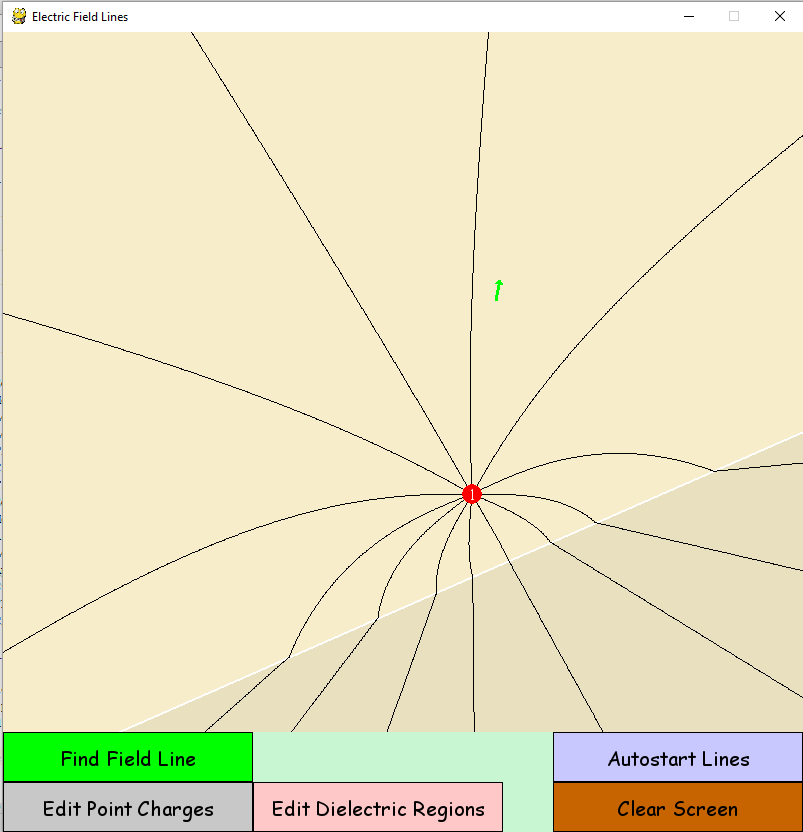

Electric Field Line Visualizer
===
Interactively displays the electric field lines for a collection of point charges. You can also set up to two dielectric regions with different permittivities!

Installation
---
Runs on Python 3.5 with pygame.

If you're on Windows, I've included a EFL.zip that you can extract anywhere on your system and hopefully EFL.exe inside the extracted folder will work.

If you're on linux, [this page](http://askubuntu.com/questions/401342/how-to-download-pygame-in-python3-3 "StackOverflow") has a helpful set of instructions for installing pygame for python3.

If you're on Mac...I don't know, google it I guess.

Usage
----
Either run `python3 EFL.py` in the directory or run the EFL.exe, depending on your system.

 1. **Edit Point Charges** mode
    * Mousewheel to choose the value of the point charge to place
    * Left click to place, right click to remove charges
    * Left Click and Drag to move charges around
 2. **Find Field Line** mode
    * Click anywhere to find the field line that runs through that point!
    * Field lines will stop calculating at screen borders, at point charges, and when it hits a zero-field point
 3. **Edit Dielectric Regions** mode
    * Mousewheel to adjust the permittivity of the region your mouse is hovering over. In place of permittivity=0, the region is set to be an ideal conductor. Negative permitivity is allowed, but might not be accurate.
    * Right click to remove a region (it's a bit unintuitive, because I need at least one region to exist, so it'll only agree to delete the region above/to the left of the interface)
    * Left click to add a region (only allows two right now)
 4. **Autostart Lines** button
    * Starts a bunch of field lines at angles around each point charge, if you're over having to click places.
    * The angles at which these start currently set by the `angleresolution` global variable
 5. **Clear Screen** deletes everything placed.

General Notes
---
Runs slower with
- more point charges
- two dielectric regions than with one

but the positional configurations and values of the regions and charges shouldn't affect its performance.

This is my first python project. A lot of StackOverflow in this one.

Let me know if you have problems!
